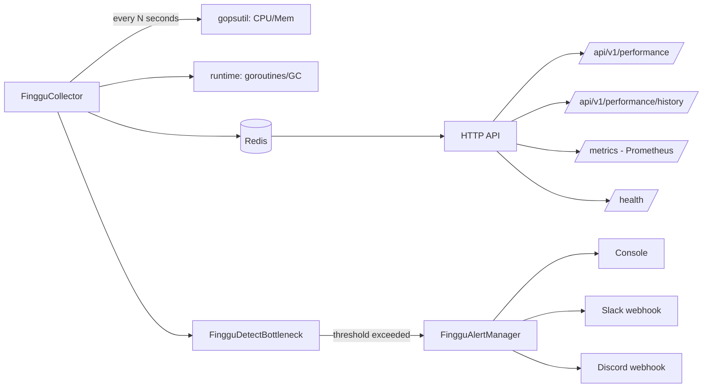

# Finggu Performance Insight Tool

[](https://github.com/sudarshanpjadhav/finggu-performance-insight-tool/actions/workflows/ci.yml)
[](https://goreportcard.com/report/github.com/sudarshanpjadhav/finggu-performance-insight-tool)
[](LICENSE)
[](go.mod)

A lightweight, self-hosted performance monitoring service written in Go. It
polls real CPU, memory, and goroutine metrics, stores a rolling history in
Redis, detects bottlenecks against configurable thresholds, and pushes
alerts to Slack/Discord — with zero external SaaS dependency and a
Prometheus-compatible `/metrics` endpoint for teams who already run Grafana.

Built for developers who want **real** insight without standing up a full
observability stack just to know "is my server about to fall over."

## Why this exists

Most lightweight monitoring scripts either hardcode fake data for a demo, or
require a heavyweight agent + SaaS subscription. This tool sits in between:
a single static binary, one Redis dependency, real OS-level metrics, and an
API you can wire into your own dashboard, CI pipeline, or alerting stack in
minutes.

## Features

| Feature | Details |
|---|---|
| Real metrics | Actual CPU%, memory%, goroutine count, GC stats — not placeholders |
| Time-series history | Rolling window stored in Redis, queryable via API |
| Threshold-based bottleneck detection | Configurable CPU/memory/goroutine thresholds, with reasons in the response |
| Multi-channel alerts | Console (default), Slack webhook, Discord webhook — pluggable interface for more |
| Alert cooldown | Prevents alert spam for a sustained issue |
| Prometheus endpoint | `/metrics` in standard exposition format — drop into an existing scrape config |
| Health endpoint | `/health` checks Redis connectivity for k8s/Docker probes |
| Graceful shutdown | Drains in-flight requests and stops the collector cleanly on SIGTERM |
| Docker-ready | `docker compose up` and you're running, Redis included |
| CI included | GitHub Actions workflow runs `go vet` + tests + build on every push |

## Architecture



## Quickstart

### Option A: Docker (recommended)

```bash
git clone https://github.com/sudarshanpjadhav/finggu-performance-insight-tool.git
cd finggu-performance-insight-tool
docker compose up
```

The API is live at `http://localhost:8080`.

### Option B: Local Go + your own Redis

```bash
git clone https://github.com/sudarshanpjadhav/finggu-performance-insight-tool.git
cd finggu-performance-insight-tool
cp .env.example .env   # adjust as needed
go mod tidy
go run .
```

## Configuration

All configuration is via environment variables (see `.env.example`):

| Variable | Default | Description |
|---|---|---|
| `FINGGU_PORT` | `8080` | HTTP server port |
| `FINGGU_REDIS_ADDR` | `localhost:6379` | Redis address |
| `FINGGU_POLL_INTERVAL_SECONDS` | `5` | How often metrics are collected |
| `FINGGU_METRIC_RETENTION` | `500` | Number of samples kept in history |
| `FINGGU_CPU_THRESHOLD` | `80` | CPU % that triggers a bottleneck alert |
| `FINGGU_MEM_THRESHOLD` | `85` | Memory % that triggers a bottleneck alert |
| `FINGGU_GOROUTINE_THRESHOLD` | `5000` | Goroutine count that triggers a possible-leak alert |
| `FINGGU_ALERT_COOLDOWN_SECONDS` | `60` | Minimum gap between repeat alerts for the same issue |
| `FINGGU_SLACK_WEBHOOK_URL` | *(empty)* | Enables Slack alerts when set |
| `FINGGU_DISCORD_WEBHOOK_URL` | *(empty)* | Enables Discord alerts when set |

## API Reference

| Method | Endpoint | Description |
|---|---|---|
| GET | `/health` | Liveness/readiness probe (checks Redis) |
| GET | `/metrics` | Prometheus-format current metrics |
| GET | `/api/v1/performance` | Latest metric snapshot (JSON) |
| GET | `/api/v1/performance/history?limit=50` | Recent metric history |
| GET | `/api/v1/performance/bottleneck` | On-demand threshold check against latest snapshot |
| GET | `/api/v1/config` | Currently active (non-secret) thresholds |

Example:

```bash
curl http://localhost:8080/api/v1/performance
```

```json
{
  "id": "finggu-1751500000000000000",
  "timestamp": "2026-07-05T10:00:00Z",
  "cpu_usage_percent": 12.4,
  "memory_usage_percent": 41.2,
  "memory_used_mb": 3271.5,
  "memory_total_mb": 7936.0,
  "goroutine_count": 8,
  "num_gc": 3,
  "heap_alloc_mb": 4.2
}
```

## Code conventions

This codebase uses a consistent `Finggu` naming convention throughout, so
ownership is obvious at a glance:

- Exported types/functions → `Finggu` prefix (`FingguCollector`, `FingguDetectBottleneck`)
- Unexported helpers → `fingguFn_` prefix (`fingguFn_GetEnv`)
- Constants → `FINGGU_` prefix

See [CONTRIBUTING.md](CONTRIBUTING.md) for details on extending it (e.g. adding a new alert channel).

## Roadmap

- [ ] PagerDuty / Opsgenie alert channel
- [ ] WebSocket endpoint for live-streaming metrics to a dashboard
- [ ] Per-process (not just host-level) metric collection
- [ ] Grafana dashboard JSON template in `/examples`

Contributions welcome — see [CONTRIBUTING.md](CONTRIBUTING.md).

## License

[MIT](LICENSE)
